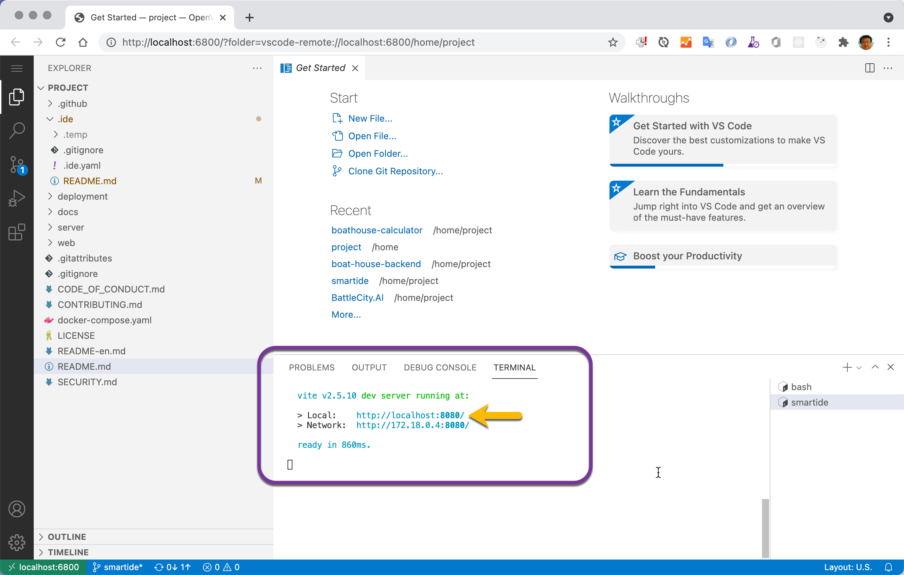
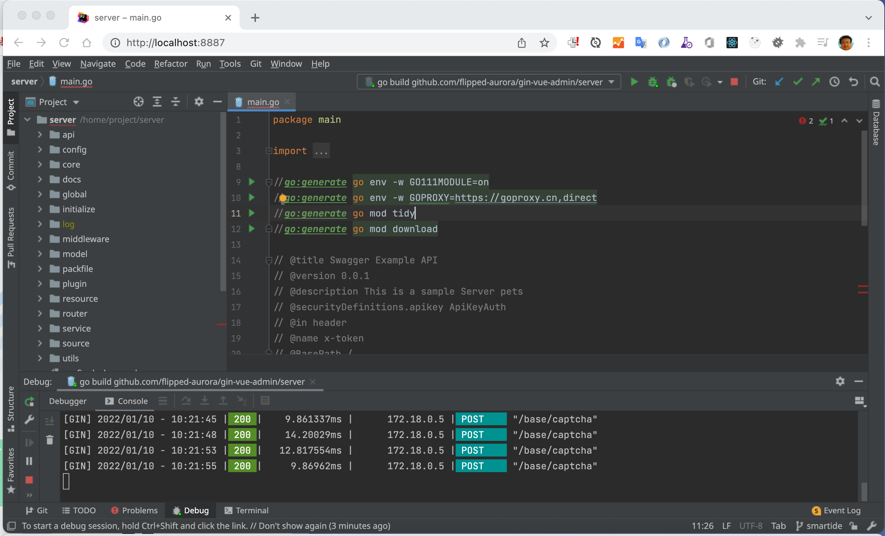
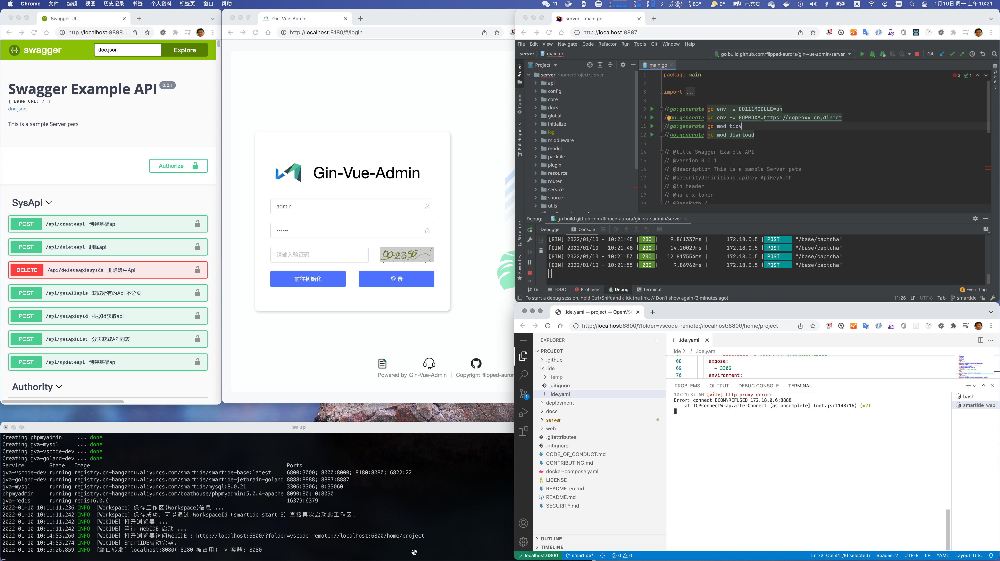

# Gin-Vue-Admin Get Started with SmartIDE

SmartIDE is next-generation CloudNative IDE, it can help you to setup development environment and start coding and debugging without any SDK or tools installation.

Get started with SmartIDE is much simplier than traditional way, you can start a fully functional SFDE (Standard Fullstack Development Environment) with just one simple command (smartide start), which includes in case of Gin-Vue-Admin:

- Node.js SDK for Vue front-end development
- Go SDK for Gin development
- VSCode WebIDE for front-end coding and debugging
- JetBrain GoLand WebIDE for backend coding and debugging
- PHPMyAdmin for managing the MySQL database server

This document includes instructions for how to use SmartIDE to do front-end and backend integrated debugging.

## 1. Video Instruction

We have prepared an video for you to see the whole setup and debugging process:

https://www.bilibili.com/video/BV1eL4y1b7ep/

## 2. Local Mode Quick Start

To start using SmartIDE is a very simple 2 steps process:

1. Install SmartIDE CLI - [Installation Documentation](https://smartide.cn/zh/docs/install/) 
2. Start up SFDE

```shell
## You can run this same command on Windows or MacOS
smartide start https://github.com/SmartIDE/gin-vue-admin.git
```

This single line command will do a series of operations, including: git clone, pull container images, boot up containerized environment, lanuch VSCode WebIDE and run npm install automatically. Everything you need to debug this application will be ready after this single comamnd.

You will see the following VSCode WebIDE screen:

> VSCode WebIDE URL https://localhost:6800



And, we have included a JetBrain GoLand WebIDE for you:

> JetBrain WebIDE URL https://localhost:8887



## 3. Remote Mode Quick Start

If you watched the video, you will see that we are using remote mode start up. SmartIDE Remote Mode allows you to leverage a remote linux machine to extend your local environment, you can use WebIDE to access this environment and use resources in the Cloud to boost up your development environment.

Still a simple 2 steps process to get started with remote mode:

> Attention: you Do Not need to install Docker Desktop if you are only use SmartIDE remote mode, only a docker ready linux machine is required in this scenario.

1. Follow  [instructions](https://smartide.cn/zh/docs/install/docker-install-linux/) to prepare your remote linux machine
2. Start up SFDE

```shell
# add remote machine into SmartIDE managed host list
smartide host add <IpAddress> --username <SSH-UserName> --password <SSH-Password> --port <SSH-Port(defaut 22)>

# get HostId
smartide host list

# start up SFDE with HostId
smartide start --host <HostId>> https://github.com/SmartIDE/gin-vue-admin.git
```

## 4. Debugging

Frontend Vue application will automatically startup, you only need to start debugging in GoLand for backend; then you are ready to go:



Related access points

- Code folder in container /home/project
- VSCode WebIDE http://localhost:6800
- Front-end application http://localhost:8080
- JetBrain GoLand WebIDE http://localhost:8887
- Backend API (Swagger-UI) http://localhost:8888/swagger-ui/index.html
- PHPMyAdmin for MySQL development http://localhost:8090

## 5. Community Support

**Note:** SmartIDE is an Open-Source product and free for individual developers and small team.

Support channels:

- Product Website https://SmartIDE.dev/en
  - You can join our [Smart EAP Group] by scan the WebChat code
- Open-Source Channels：
  - https://githbu.com/SmartIDE
  - https://gitee.com/SmartIDE

  > Please **star** our project if you like it.

- Video Channel
  - https://www.youtube.com/channel/UC3orN6VzH1DSy25NnQlEH4g 


Thanks for using SmartIDE.

> Be a Smart Developer，开发从未如此简单。


